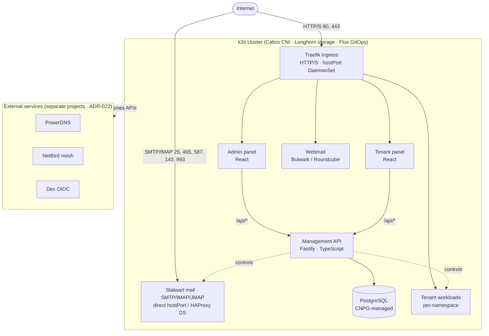

# Insula

A self-hostable, Kubernetes-native **web & mail hosting platform** — an open
replacement for Plesk/cPanel. Multi-tenant websites, databases, mailboxes,
DNS, backups and TLS, managed from an admin panel and a tenant panel, on
self-managed **k3s** clusters (a single VPS to a small HA fleet).

> **Status:** Phase 1 (MVP). Self-hostable today; first production cutover in
> progress. License: **AGPL-3.0** (see [LICENSE](LICENSE)).

---

## What you get

- **Multi-tenant hosting** — isolated namespace + workloads per tenant (PHP,
  Node.js, static, and managed app stacks from an external catalog).
- **Mail** — [Stalwart](https://stalw.art) SMTP/IMAP/JMAP with DKIM,
  autodiscover, webmail (Bulwark or Roundcube), per-tenant mailboxes & backups.
- **Databases** — per-tenant PostgreSQL/MariaDB with a web SQL manager,
  import/export, and SFTP access.
- **DNS, TLS, backups** — PowerDNS integration, cert-manager + Let's Encrypt,
  and tenant/cluster backup with a Plesk-style restore cart.
- **Operable** — admin + tenant React panels, GitOps via Flux, one-command
  bootstrap, single-button HA scale-up, and a security/hardening dashboard.

## Architecture



The backend API is **never exposed directly** — the panels reverse-proxy
`/api/*` to it in-cluster. DNS, VPN mesh and IAM are consumed as external APIs,
not bundled.

### Tech stack

| Layer | Technology |
|-------|-----------|
| Orchestration | k3s · Calico CNI · **Traefik** ingress · Longhorn storage · Flux v2 |
| Backend | Node.js 22 · Fastify 4 · TypeScript 5 · Drizzle ORM |
| Database | **PostgreSQL** (CloudNativePG-managed); in-memory cache (no Redis) |
| Frontend | React 18 · Vite · Tailwind CSS · shadcn/ui · TanStack Query · Zustand |
| Mail | Stalwart (SMTP/IMAP/JMAP) · Bulwark/Roundcube webmail |
| Auth | JWT Bearer tokens · external Dex OIDC |
| TLS / secrets | cert-manager + Let's Encrypt · Sealed Secrets |
| CI/CD | GitHub Actions · Flux v2 (3-branch GitOps) |

## Quickstart

### Local development

Requires **Node.js 22+** and **Docker**. The local stack runs a full k3s
cluster in Docker (DinD) — not standalone DB containers.

```bash
git clone https://github.com/insulahq/insula.git
cd insula
npm install
./scripts/local.sh up        # build images + bring up the in-Docker k3s stack
```

Admin panel: `https://admin.k8s-platform.test:2011` · login `admin@k8s-platform.test` / `admin`.
`./scripts/local.sh down` to stop, `reset` to wipe. See
[docs/](docs/) for the full local topology.

### Deploy to a server

SSH into a fresh **Debian 12+/13**, **Ubuntu 22.04+/24.04**, or RHEL 9-family
host and bootstrap in one pass (k3s, Calico, Traefik, Longhorn, cert-manager,
Flux, and the platform):

```bash
git clone https://github.com/insulahq/insula.git && cd insula
./scripts/bootstrap.sh --domain hosting.example.com
```

Add worker nodes, scale to HA, and harden via the same script and the admin
UI. See the deployment docs below.

### Running from a fork

Local dev and PR CI work on a fork unmodified. To deploy a fork to a real
cluster (so it pulls images your CI built), repoint the image org once:

```bash
./scripts/preflight-image-org.sh        # detects your fork from `git remote`
```

Full details: [docs/04-deployment/FORK-AND-DEPLOY.md](docs/04-deployment/FORK-AND-DEPLOY.md).

## Repository layout

```
packages/api-contracts/   # Shared Zod schemas + types — the API single source of truth
backend/                  # Fastify management API (port 3000)
frontend/admin-panel/     # React admin UI (port 5173)
frontend/tenant-panel/    # React tenant UI (port 5174)
k8s/{base,overlays}/      # Kustomize manifests (dev / staging / production)
scripts/                  # bootstrap.sh, local.sh, CI guards, integration tests
docs/                     # Architecture, ADRs, operator runbooks
```

Each top-level package has its own `README.md`. Two external catalogs (ADR-026)
supply tenant content: **workload runtimes** (apache-php, nginx-php, nodejs,
MariaDB, …) come from an operator-registered workload catalog (Settings →
Catalog Repos, no hardcoded default), and **managed app stacks** (WordPress,
Nextcloud, …) come from the
[application-catalog](https://github.com/insulahq/application-catalog) repo.

## Documentation

| Topic | Location |
|-------|----------|
| Platform architecture | `docs/01-core/PLATFORM_ARCHITECTURE.md` |
| Database schema | `docs/01-core/DATABASE_SCHEMA.md` |
| Management API spec | `docs/04-deployment/MANAGEMENT_API_SPEC.md` |
| Release & upgrade plan | `docs/04-deployment/HOLISTIC_RELEASE_AND_UPGRADE_PLAN.md` |
| Fork & deploy | `docs/04-deployment/FORK-AND-DEPLOY.md` |
| Architecture decisions | `docs/07-reference/` (ADRs) |

## Contributing & security

- Contribution guide, dev workflow, and release/versioning conventions:
  [CONTRIBUTING.md](CONTRIBUTING.md).
- Vulnerability disclosure: [SECURITY.md](SECURITY.md) (please **do not** open a
  public issue for security reports).

## License

© Insula contributors. Licensed under the **GNU Affero General Public License
v3.0** — see [LICENSE](LICENSE). The AGPL's network-use clause means that if you
run a modified version as a network service, you must offer its source to users
of that service.
