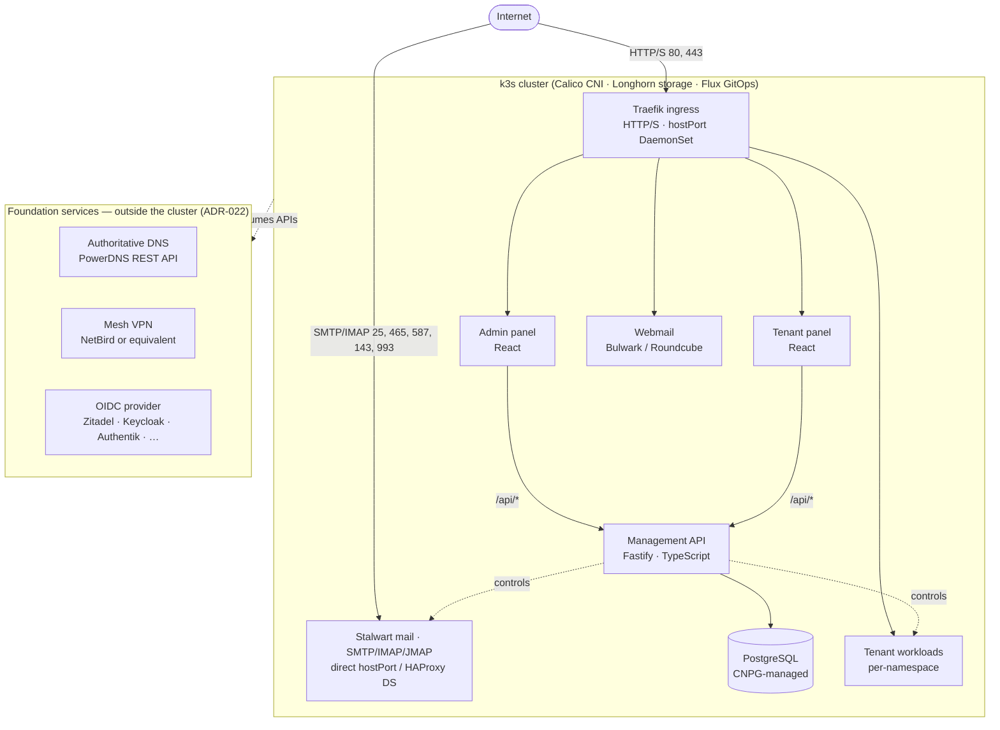

# Insula

A self-hostable, Kubernetes-native **web & mail hosting platform**. One command
turns a fresh Linux server into multi-tenant hosting — websites, databases,
mailboxes, DNS, TLS, backups and monitoring — driven from an admin panel and a
tenant panel, on self-managed **k3s** clusters that grow from a single VPS to an
HA fleet.

> **Status:** In production. Signed CalVer releases; upgrades are pulled on the
> operator's command, never pushed. License: **AGPL-3.0** (see [LICENSE](LICENSE)).

---

## What you get

Everything a hosting panel does, on infrastructure that does considerably more:

- **Multi-tenant hosting with real isolation** — a namespace, network policy,
  resource quota and storage per tenant; PHP, Node.js, Python, Go, Java, .NET,
  Ruby, Rust and Bun side by side — or any container image you bring — from the
  curated catalog, an opt-in community app-stack catalog, or your own registry.
- **Mail taken seriously** — [Stalwart](https://stalw.art) SMTP/IMAP/JMAP with
  per-domain DKIM, DMARC/TLS report intake, autodiscover, webmail (Bulwark or
  Roundcube), send-rate protection, deliverability probes (PTR, DNSBL) and
  abuse alerting.
- **Databases & files** — per-tenant PostgreSQL/MariaDB with a browser SQL
  manager and import/export, a web file manager, and an SFTP/SCP/rsync gateway
  with per-purpose credentials.
- **Failure rehearsed, not assumed** — point-in-time database recovery,
  off-site encrypted backups (S3/SFTP/SMB), a granular restore cart,
  cold-start disaster recovery, and tenant migration between clusters — each
  exercised against a live cluster by a destructive integration suite
  (`scripts/integration-*.sh`), not just unit-tested.
- **Security in the path, not on a dashboard** — per-site WAF (OWASP CRS),
  automatic intrusion bans, free TLS, a managed dual-stack node firewall,
  role-based access, passkeys, and a step-up-gated node terminal.
- **Operations built in** — metrics, SLO alerting, per-tenant bandwidth
  metering, memory-event tracking, node health with one-click recovery,
  and a notification system that names what happened and links to the page
  that fixes it.
- **A growth path, not a migration day** — start on one small VPS; add nodes
  and switch on high availability (Postgres, storage replicas, stateless
  replicas, topology spread) with a single action.
- **Verifiable supply chain** — signed releases verified on the node before
  anything upgrades, GitOps via Flux, and no hidden control plane: the repo is
  the platform.

## Architecture


```mermaid
flowchart TB
    Internet([Internet]) -->|"HTTP/S 80, 443"| Traefik
    Internet -->|"SMTP/IMAP 25, 465, 587, 143, 993"| Mail

    subgraph cluster["k3s cluster (Calico CNI · Longhorn storage · Flux GitOps)"]
        Traefik[Traefik ingress<br/>HTTP/S · hostPort DaemonSet]
        Admin[Admin panel<br/>React]
        Tenant[Tenant panel<br/>React]
        API[Management API<br/>Fastify · TypeScript]
        PG[(PostgreSQL<br/>CNPG-managed)]
        Mail[Stalwart mail · SMTP/IMAP/JMAP<br/>direct hostPort / HAProxy DS]
        Web[Webmail<br/>Bulwark / Roundcube]
        Work[Tenant workloads<br/>per-namespace]

        Traefik --> Admin & Tenant & Web & Work
        Admin -->|/api/*| API
        Tenant -->|/api/*| API
        API --> PG
        API -.controls.-> Mail & Work
    end

    cluster -.consumes APIs.-> Ext
    subgraph Ext["Foundation services — outside the cluster (ADR-022)"]
        DNS[Authoritative DNS<br/>PowerDNS REST API]
        Mesh[Mesh VPN<br/>NetBird or equivalent]
        OIDC[OIDC provider<br/>Zitadel · Keycloak · Authentik · …]
    end
```

The backend API is **never exposed directly** — the panels reverse-proxy
`/api/*` to it in-cluster.

DNS, mesh VPN and IAM live **outside** the cluster on purpose: authoritative DNS
must survive the cluster it serves, the mesh is how you reach the cluster in the
first place, and IAM is usually shared with other systems (ADR-022). Each is
consumed over a configurable endpoint — set them in the admin panel and point
them anywhere. See [Backbone](#companion-project-backbone) for a ready-made
deployment of all three.

### Tech stack

| Layer | Technology |
|-------|-----------|
| Orchestration | k3s · Calico CNI · **Traefik** ingress · Longhorn storage · Flux v2 |
| Backend | Node.js 22 · Fastify 4 · TypeScript 5 · Drizzle ORM |
| Database | **PostgreSQL** (CloudNativePG-managed); in-memory cache (no Redis) |
| Frontend | React 18 · Vite · Tailwind CSS · shadcn/ui · TanStack Query · Zustand |
| Mail | Stalwart (SMTP/IMAP/JMAP) · Bulwark/Roundcube webmail |
| Auth | JWT Bearer tokens · passkeys · any external OIDC provider (Dex ships in dev/staging only, as a test IdP) |
| TLS / secrets | cert-manager + Let's Encrypt · Sealed Secrets |
| CI/CD | GitHub Actions · Flux v2 (3-branch GitOps) |

## Companion project: Backbone

Insula hosts the sites; **[Backbone](https://github.com/insulahq/backbone)** runs
the foundation underneath it. It is provider-agnostic Ansible automation that
deploys a redundant, self-healing pair of servers in two locations:

| Backbone provides | Insula consumes it as |
|---|---|
| **PowerDNS** (authoritative, native mode, read-write on both nodes) | the DNS provider group behind every zone and record |
| **NetBird** WireGuard mesh (management · signal · relay) | the admin access path to the cluster |
| **Zitadel** central IAM (OIDC/OAuth2) | the OIDC issuer for panel login |

Underneath those three it runs its own operational layer: PostgreSQL streaming
replication with repmgr (~80 s automatic failover, split-brain prevention),
Traefik with DNS-01 ACME, Gatus monitoring with multi-channel alerting, an
OpenZiti zero-trust overlay, and encrypted restic backups off-site.

The split is deliberate and the coupling is thin: DNS must not share fate with
the cluster it serves, the mesh is what you use to reach that cluster, and IAM is
usually shared with other systems (ADR-022).

**Backbone is optional.** Every one of those three is reached over a
configurable endpoint, so any authoritative DNS with a PowerDNS-compatible API,
any WireGuard-style underlay, and any OIDC provider will do. Backbone is simply
the deployment we run and test against.

## Quickstart

### Local development

Requires **Node.js 22+** and **Docker**. The local stack runs a full k3s
cluster in Docker (DinD) — not standalone DB containers.

```bash
git clone https://github.com/insulahq/insula.git
cd insula
npm install
./scripts/local.sh up        # build images + bring up the in-Docker k3s stack
```

Admin panel: `https://admin.k8s-platform.test:2011` · login `admin@k8s-platform.test` / `admin`.
`./scripts/local.sh down` to stop, `reset` to wipe. See
[docs/](docs/) for the full local topology.

### Deploy to a server

SSH into a fresh **Debian 12+/13**, **Ubuntu 22.04+/24.04**, or RHEL 9-family
host, download the signed `insula` binary, and bootstrap in one pass (k3s,
Calico, Traefik, Longhorn, cert-manager, Flux, and the platform) — no repo
clone; the installer travels inside the binary:

```bash
# Needs curl + openssl on the host (openssl is preinstalled everywhere; curl is
# missing on minimal Debian: apt-get install -y curl ca-certificates).
curl -fsSLO https://github.com/insulahq/insula/releases/latest/download/insula-linux-amd64

# Verify the signature before running it — must print "Verified OK".
curl -fsSLO https://github.com/insulahq/insula/releases/latest/download/insula-linux-amd64.sig
curl -fsSLO https://raw.githubusercontent.com/insulahq/insula/main/platform/cosign.pub
openssl dgst -sha256 -verify cosign.pub \
  -signature <(base64 -d insula-linux-amd64.sig) insula-linux-amd64

chmod +x insula-linux-amd64 && sudo mv insula-linux-amd64 /usr/local/bin/insula
sudo insula bootstrap --join-as server --domain hosting.example.com --acme-email ops@example.com
```

Add worker nodes, scale to HA, and harden via the same binary and the admin
UI. (A repo checkout + `./scripts/bootstrap.sh` still works for development.)
See the deployment docs below.

### Running from a fork

Local dev and PR CI work on a fork unmodified. To deploy a fork to a real
cluster (so it pulls images your CI built), repoint the image org once:

```bash
./scripts/preflight-image-org.sh        # detects your fork from `git remote`
```

Full details: [docs/development/FORK-AND-DEPLOY.md](docs/development/FORK-AND-DEPLOY.md).

## Repository layout

```
packages/api-contracts/   # Shared Zod schemas + types — the API single source of truth
backend/                  # Fastify management API (port 3000)
frontend/admin-panel/     # React admin UI (port 5173)
frontend/tenant-panel/    # React tenant UI (port 5174)
k8s/{base,overlays}/      # Kustomize manifests (development / staging / production)
platform/                 # Signed-release material: host migrations, VERSION, cosign.pub
scripts/                  # bootstrap.sh, local.sh, CI guards, integration harnesses
docs/                     # Architecture, ADRs, operator runbooks
documentation/            # User manual (MkDocs) → insulahq.github.io
```

Each top-level package has its own `README.md`.

Tenant content comes from catalog repositories (ADR-026). The **Official
Catalog** ([application-catalog](https://github.com/insulahq/application-catalog))
is seeded on install and ships **primitives only** — runtimes (apache-php,
nginx-php, nodejs, …), databases, services, static hosting — so that every image
in a default install is one we build and harden. Self-contained **app stacks**
(WordPress, Nextcloud, Gitea, …) live in the separate, **opt-in**
[application-catalog-community](https://github.com/insulahq/application-catalog-community)
repo, which an admin adds under *Applications → Repositories*. Bring-your-own
container images are a third, non-catalog path (ADR-036).

## Documentation

| Topic | Location |
|-------|----------|
| Platform architecture | `docs/architecture/PLATFORM_ARCHITECTURE.md` |
| Database schema | `docs/architecture/DATABASE_SCHEMA.md` |
| Management API spec | `docs/architecture/MANAGEMENT_API_SPEC.md` |
| Fork & deploy | `docs/development/FORK-AND-DEPLOY.md` |
| Architecture decisions | `docs/architecture/adr/` |
| User manual (operator · admin · tenant) | [insulahq.github.io](https://insulahq.github.io/) (source in `documentation/`) |
| Foundation services (DNS · mesh · IAM) | [insulahq/backbone](https://github.com/insulahq/backbone) |

## Contributing & security

- Contribution guide, dev workflow, and release/versioning conventions:
  [CONTRIBUTING.md](CONTRIBUTING.md).
- Vulnerability disclosure: [SECURITY.md](SECURITY.md) (please **do not** open a
  public issue for security reports).

## License

© Insula contributors. Licensed under the **GNU Affero General Public License
v3.0** — see [LICENSE](LICENSE). The AGPL's network-use clause means that if you
run a modified version as a network service, you must offer its source to users
of that service.
